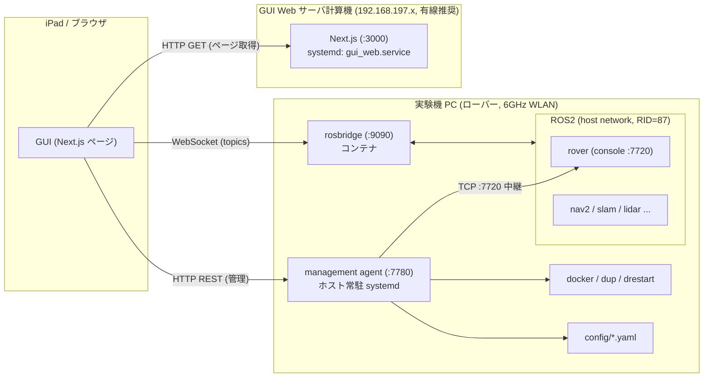

# project_GUI 改良提案: ROS トピックベース Web GUI + 管理ツール

作成日: 2026-07-27 / 対象: `project_GUI` (+ `project_rf_rover`, `acsl_infra`)

## 1. ゴール

iPad 等のブラウザだけで、遠隔から以下ができる状態を目指す。

1. **コンソール機能** — 目標位置設定・初期推定値指定・start/stop/reset/save
2. **グラフィカル表示** — RViz 相当の 2D/3D 表示 (地図・自己位置・参照経路・LiDAR)
3. **HB 表示** — `/Robot{rid}/Heartbeat` の可視化と鮮度監視
4. **管理機能** — コンテナ再起動などの運用操作 + パラメータ (YAML) チューニング

最終ユースケース: 「iPad からローバーを呼ぶ / お店に買い出しに行かせて届けてもらう」。
運用形態: プロジェクト本体 + マネージメントツールを **systemd 自動起動**し、SSH レスで GUI から完結。

## 2. 現状整理

### 2.1 project_GUI の現状

- Next.js 15 + roslib + rosbridge_server + キオスク Chromium という構成は既にあり、方向性は正しい。
- ただし現状は「同一マシンのキオスク端末」前提: `ws://localhost:9090` 決め打ち、`RID_IN_PAGE` を `setup.sh` の sed で書き換える方式、autostart は XDG desktop (GUI セッション必須) で systemd ではない。
- コマンド送信は `/Robot{rid}/console2converter` → `gui_converter` → `/Robot{rid}/console2robot` (Int8MultiArray)。int 配列なので**初期推定値の yaw (float) が送れない**、応答も返らない。
  - なお `gui_converter.py` は `self.robot.create_publisher` (存在しない属性) で起動時に落ちるバグあり (今回修正)。
- 旧ディレクトリレイアウト (`1_launcher/` 等) のままで、`setup.sh` が参照する `$ACSL_ROS2_DIR/4_docker/...` は現 infra に存在しない (→ 現 `docker/` へ要修正、今回修正)。

### 2.2 機体側 (project_rf_rover) の既存インタフェース

| 用途 | インタフェース | 備考 |
|---|---|---|
| コンソール | TCP :7720 (1コマンド/接続, 1行応答) | `target <floor> <id> [init_floor] [init_cid] [yaw]` / `hb` / `start` / `stop` / `reset` / `save`。**フル機能はここだけ** (初期推定値+AMCL再シード+float yaw) |
| コンソール(旧) | `/Robot{rid}/console2robot` `Int8MultiArray` | int のみ・即時発進 (auto_start)・応答なし |
| HB | `/Robot{rid}/Heartbeat` `std_msgs/String` 10Hz | 1行テキスト。フォーマット固定でパース可能 |
| 可視化 | `/map` (OccupancyGrid), `/amcl_pose`, `/rover_debug/ref_path` (Path), `/rf_reference_point_stamped`, `/scan` | すべて map frame 基準で GUI 描画に十分 |
| teleop | `/rover_twist` `geometry_msgs/Twist` | 既存ジョイスティックがそのまま使える |
| パラメータ | `config/rover.yaml` + 差分 YAML (`exp.yaml` 等) | **起動時読み込みのみ**。ROS param として動的公開されていない → 「YAML 編集 + `drestart rover`」が正しいチューニング手順 |

### 2.3 infra 側の既存資産

- `project_launch.service` (systemd) + `acsl setup_systemd` が既にあり、**プロジェクト本体の自動起動は既存機構で可能**。ただし `Type=oneshot` で異常時再起動なし。
- 常駐デーモン向けには `acsl_infra/nightly_audit/slack_control.service` (user unit, `Restart=always`, linger) のパターンが流用できる。
- コンテナは全て `network_mode: host` → rosbridge :9090 / Web :3000 / console :7720 はホストのポートに直結。
- コンテナ操作は `dps` / `drestart` (= `drm`+`dup`、RID 引き継ぎのための正しい再起動) / `dlogs` / `drm all` がスクリプトとして存在し、`.acsl/bashrc` を source すれば非対話 bash から呼べる。

## 3. 全体アーキテクチャ提案

**設計原則: 「DDS (ROS2) を機体の外に出さない」**。
Wi-Fi (特にローミングする移動体) 越しの DDS はマルチキャスト・ディスカバリで苦労が多い
(rf_rover に discovery server 対策が入っているのがその証拠)。GUI 系はすべて
**WebSocket / HTTP (TCP)** に変換してから無線を渡す。これで「どこまで ROS2 か」の答えは:

- **ROS2**: 実験機 PC の中だけ (コンテナ間は host network + 同一 RID)
- **rosbridge (WebSocket)**: 実験機 PC 上で ROS2 ⇔ WS 変換。リアルタイム系 (HB・可視化・teleop・トピックコンソール) はこれ
- **HTTP (REST)**: 管理系 (コンテナ操作・YAML 編集・TCP コンソール中継)。**ROS が死んでいても動く必要がある**ので ROS に載せない



### 3.1 ハードウェア構成

| 機材 | 役割 | 置くもの |
|---|---|---|
| **実験機 PC** (ローバー搭載) | data plane + 機体側管理 | 機体コンテナ群 (既存) + **rosbridge コンテナ** + **management agent (ホスト常駐)** |
| **GUI Web サーバ計算機** | GUI 配信 | Next.js 本番サーバ (`next build` + `next start`)。将来: 複数機体の HB 集約・記録、地図/資産配信 |
| **ブリッジ専用機** | **不要** | ブリッジ (rosbridge + agent) は実験機 PC に同居させる。台数が増えたら GUI サーバに fleet gateway を置く方式に拡張 |
| iPad | 操作端末 | ブラウザのみ (インストール不要) |

ブリッジを実験機 PC に置く理由: (1) DDS を無線に出さないため変換点は機体上にある必要がある、
(2) コンテナ再起動やログは機体ローカルでしか取れない、(3) 追加ハードが不要。

開発中は「GUI サーバ = 開発 PC (WSL2 可)」「実験機 PC = 現行のまま」で成立する。
現行キオスク運用 (同一マシン) も本構成の縮退形としてそのまま動く。

### 3.2 ネットワーク構成

- サブネット: **192.168.197.0/24** (確定案に合わせる)。全機材同一 L2 に置き、ルーティング/NAT を挟まない。
- ローバー: 6GHz WLAN (Wi-Fi 6E/7)。**192.168.197.21〜 静的 IP** (機体番号で採番, 例 Robot1 = .21)。
  6GHz は障害物に弱いので、走行エリアの AP カバレッジ確認と、5GHz フォールバック SSID を同一サブネットで用意しておくこと。
- GUI サーバ: **有線接続を推奨**、静的 IP (例 .10)。iPad ⇔ GUI サーバ間が無線×無線にならないようにする。
- iPad: 同 WLAN、DHCP で可。ローバーへは IP 直指定 (GUI の設定画面に保存) か、将来 mDNS (`robot1.local`)。
- **通信は 3 本だけ** (すべて TCP、AP のクライアント分離が有効だと通らないので注意):

| 経路 | プロトコル | ポート |
|---|---|---|
| iPad → GUI サーバ | HTTP | 3000 |
| iPad → 実験機 PC | WebSocket (rosbridge) | 9090 |
| iPad → 実験機 PC | HTTP (management agent) | 7780 |

- 「外出先から買い出し指示」は LAN 外アクセスなので、**ポート開放ではなく VPN (Tailscale/WireGuard) を推奨**。
  GUI サーバと実験機 PC に Tailscale を入れれば、GUI 側は URL がそのままで外から使える (Phase 3)。

### 3.3 プロトコル選定の比較

| 案 | 内容 | 評価 |
|---|---|---|
| A. ROS2 を GUI サーバまで通す (discovery server) | GUI サーバにも ROS2 | ✗ iPad で完結しない、Wi-Fi 越し DDS の調整コストが高い、GUI サーバに ROS 依存が生える |
| **B. rosbridge (機体上) + HTTP 管理 API (機体上)** | 本提案 | ◎ 標準 (rosbridge_suite + roslib)、既存資産流用、ROS 停止時も管理可能 |
| C. 独自 WS ブリッジ拡張 (`sitl/ros2_ws_external_control_bridge.py` 系) | SITL 用の自前ブリッジを実機にも | △ トピック追加のたびにブリッジ改修が必要。rosbridge なら GUI 側だけで済む |

補足: rosbridge は subscribe 時に `throttle_rate` / `queue_length` を指定でき、`/map` や `/scan` のような重いトピックの帯域制御が GUI 側でできる。これも B 案の利点。

### 3.4 コンソールコマンドの経路

- **正**: GUI → agent `POST /api/console {"cmd": "target 1 1 4 15 1.57"}` → TCP :7720 → 応答文字列を GUI に返す。
  既存 TCP コンソールのフル機能 (初期推定値, float yaw, 応答) を**機体側改修ゼロ**で使える。
- **副** (agent 不達時のフォールバック): rosbridge で `/Robot{rid}/console2robot` に publish (int のみ・即発進・応答なし)。
- 将来 (Phase 2): rover 側に `/Robot{rid}/console_cmd` / `console_resp` (std_msgs/String, JSON) を追加して
  ROS トピックに一本化 → TCP 中継を廃止。`_handle_console_cmd()` をコールバックとして共用すれば実装は薄い。

## 4. 機能設計

### 4.1 コンソールタブ

- フロア選択 + 部屋ボタン (既存 `floor_map.json` を継続利用) → `target <floor> <id>` を組み立て
- 初期推定値フォーム (floor / cid / yaw) → `target f id cf cid yaw` (AMCL 再シード付き)
- start / stop / reset / save ボタン + **コマンドログ (送信と応答を時系列表示)**
- 緊急停止は常時表示 (stop 2 連打相当)
- 既存ジョイスティック teleop (`/rover_twist`) は同タブに残す

### 4.2 可視化タブ (RViz-lite)

2D Canvas 描画 (プロトタイプ)。roslib subscribe:

| レイヤ | トピック | throttle |
|---|---|---|
| 占有格子地図 | `/map` | 5s (latched なので実質初回のみ) |
| フロアグラフ | `floor_map.json` (ローカル) | - |
| 自己位置 + 共分散 | `/amcl_pose` | 200ms |
| 参照経路 | `/rover_debug/ref_path` | 500ms |
| 参照点 | `/rf_reference_point_stamped` | 200ms |
| LiDAR | `/scan` (自己位置基準で近似描画) | 500ms |

3D (three.js は導入済み) は Phase 2。ドローン (project_drone2) 対応時に z 軸が要るのでそこで導入。

### 4.3 HB タブ

- `/Robot{rid}/Heartbeat` を subscribe し、正規表現でフィールド分解
  (status/Goal/Local/Est/seg/cov/r 等) → ステータスカード表示
- **鮮度監視**: 最終受信からの経過で OK (<2s) / WARN / LOST (>5s) を色表示 (機体側 watchdog の 2s に合わせる)
- 生ログ末尾 N 行も表示 (console `w` 相当)

### 4.4 管理タブ

- **コンテナ管理**: 一覧 (dps 相当) / 個別 `drestart` / stop / ログ表示 (tail スナップショット) /
  プロジェクト一括 down (`drm all`) & up (`dup all <MODE> [config]`)
- **パラメータチューニング**: `config/**/*.yaml` の一覧 → エディタで編集 → 保存 (agent が `.bak` 退避) →
  「反映にはコンテナ再起動が必要」バナー + その場で `drestart rover` ボタン。
  YAML は起動時読み込みのみなのでこれが正しい形。将来リアルタイム調整が要る値だけ ROS param 化を検討
  (注意: `Saturation.maxv/maxw` は毎ループ `slam_jump.normal_*` で上書きされる等、編集箇所ガイドを画面に出す)
- **システム**: `project_launch.service` の状態表示、ホスト uptime 等

### 4.5 management agent (新規、機体ホスト常駐)

Python 標準ライブラリのみの単一ファイル HTTP サーバ (:7780)。ROS にも Docker SDK にも依存しない。

| エンドポイント | 動作 |
|---|---|
| `GET /api/health` | 生存確認 (hostname, uptime, systemd 状態) |
| `POST /api/console` | TCP :7720 へ 1 コマンド中継、応答を返す |
| `GET /api/containers` | `docker ps -a` (JSON) |
| `POST /api/containers/<name>/restart` | `.acsl/bashrc` を source して `drestart <name>` |
| `POST /api/containers/<name>/stop` | `docker stop` |
| `GET /api/containers/<name>/logs?tail=N` | `docker logs --tail N` (スナップショット) |
| `POST /api/project` | `{"action":"up","mode":"EXP"}` → `dup all EXP` / `{"action":"down"}` → `drm all` |
| `GET/PUT /api/configs[/<path>]` | `$ACSL_WORK_DIR/config` 配下 YAML の一覧/取得/保存 (パストラバーサル防止, `.bak` 退避) |

セキュリティ: LAN 内利用前提。`AGENT_TOKEN` 環境変数を設定すると `X-Agent-Token` ヘッダ必須になる (GUI 設定画面にトークン欄)。外部公開はしない (外からは VPN 経由)。

## 5. systemd 自動起動設計

| ホスト | ユニット | 内容 |
|---|---|---|
| 実験機 PC | `project_launch.service` (既存, root) | 機体コンテナ群。既存 `acsl setup_systemd` を利用。rosbridge を `project_launch.sh` に追加して一緒に上げる |
| 実験機 PC | `acsl-gui-agent.service` (新規, **user unit**) | management agent。`Restart=always` + `loginctl enable-linger` (nightly_audit の slack_control パターン) |
| GUI サーバ | `gui_web.service` (新規, user unit) | `next build` 済みアプリを `next start -p 3000` |

キオスク (`start_kiosk.desktop`) は実験機と GUI が同一マシンの現地運用向けにそのまま残す。

## 6. 段階的ロードマップ

| Phase | 内容 | 状態 |
|---|---|---|
| **0. プロトタイプ** | GUI 4 タブ化 (コンソール/可視化/HB/管理) + management agent + 接続設定 UI (ホスト/RID を UI から変更、sed 廃止) + systemd ユニット雛形 | **今回実装** |
| 1. 配備・検証 | GUI サーバ分離配置、192.168.197 系で実機疎通、rosbridge を `project_launch.sh` に組込み、`acsl setup_systemd` 適用、iPad 実機評価 (タッチ操作・画面レイアウト) | 次 |
| 2. ROS 統一・体験向上 | コンソールの ROS トピック JSON 化 (TCP 中継廃止)、three.js 3D 表示、カメラ (`web_video_server` or CompressedImage 継続)、YAML エディタのスキーマ検証 (編集可能キーのホワイトリスト) | |
| 3. 遠隔・サービス化 | Tailscale で LAN 外アクセス、「呼ぶ/届ける」タスク UI (行き先キュー・到着通知)、複数機体 (fleet gateway・HB 集約)、認証強化 (HTTPS + ログイン) | |
| 4. ドローン対応 | project_drone2 の GUI 共通化 (3D 必須)、機体種別ごとのタブ構成切替 | |

## 7. 今回のプロトタイプで入った変更

- `GUI/` — 4 タブ構成に全面改修 (詳細は `docs/prototype_notes.md`)
  - 接続設定 (rover ホスト/ポート/RID/トークン) を localStorage 管理。`RID_IN_PAGE` sed 廃止
- `management_agent/agent.py` — 上記 REST API (Python stdlib のみ)
- `management_agent/acsl-gui-agent.service` + `install.sh` — user unit 導入スクリプト
- `deploy/gui_web.service` — GUI サーバ用ユニット雛形
- `2_ros_packages/gui_converter` — クラッシュバグ修正 (`self.robot` → `self`)
- `setup.sh` — 現 infra レイアウト対応 (`4_docker` → `docker`)、sed 方式の廃止

試し方 (実験機 PC 上で完結する最小構成):

```bash
# 1) 機体側: 通常どおり起動 (rosbridge も上げる)
dup all EXP        # または SIM / isaacsim
dup rosbridge

# 2) 機体側: management agent (手動 or install.sh で systemd 化)
cd <project_GUI>/management_agent && ./install.sh   # or: python3 agent.py

# 3) GUI (開発 PC でも実験機 PC でも可)
cd <project_GUI>/GUI && npm i && npm run dev        # 本番は build && start

# 4) ブラウザで http://<GUIホスト>:3000 → 右上の接続設定に実験機 PC の IP を入力
```
